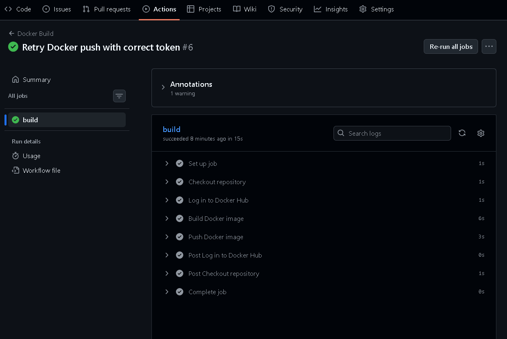
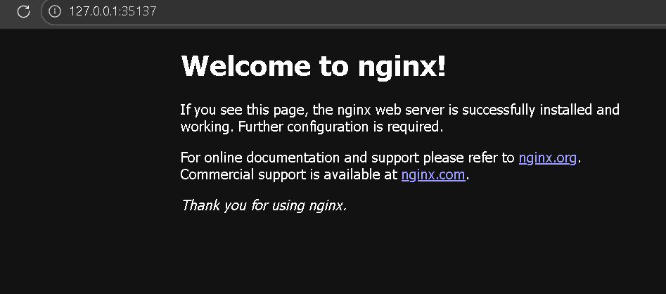
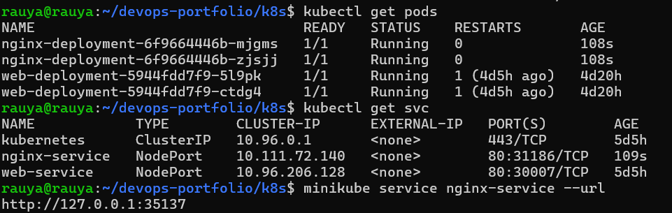

# Cloud & DevOps Portfolio

This portfolio demonstrates hands-on experience with **Terraform**, **AWS**, **Kubernetes**, **Docker**, and **CI/CD using GitHub Actions**.  

It showcases my skills in building cloud infrastructure, automating workflows, and documenting projects professionally.

---

## 🚀 Technologies Used
- Terraform
- AWS (EC2)
- Kubernetes (Minikube)
- Docker
- GitHub Actions (CI/CD)
- Linux
- Git & GitHub

---

## 🏗️ Terraform Project

This project demonstrates provisioning cloud resources using Terraform with a clear and modular structure.

### Terraform Structure

### AWS EC2 Instance

---

## 🔄 CI/CD Pipeline (GitHub Actions)

Automation using GitHub Actions to streamline deployment and validation.

### CI Success

### Workflow Logs

### README Preview

---

## 🐳 Docker Project

This project demonstrates containerizing an Nginx web server using Docker and automating the build with GitHub Actions.

### Nginx Container Running Locally

### GitHub Actions Docker Build Success

---

## 🧩 Kubernetes Project

This project demonstrates a simple Kubernetes deployment using Minikube.

### Nginx Deployment
- Deployed 2 replicas of Nginx using a Deployment.
- Exposed the application using a NodePort Service.

### Screenshots

**1. Nginx running in browser:**

**2. Cluster status (pods + service):**

---

## ✅ Summary

This portfolio demonstrates:
- Infrastructure as Code using Terraform
- Provisioning cloud resources on AWS
- Docker containerization with local verification
- CI/CD automation using GitHub Actions
- Kubernetes deployment using Minikube
- Clear structure and professional documentation

