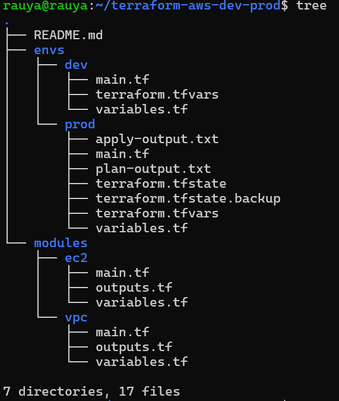
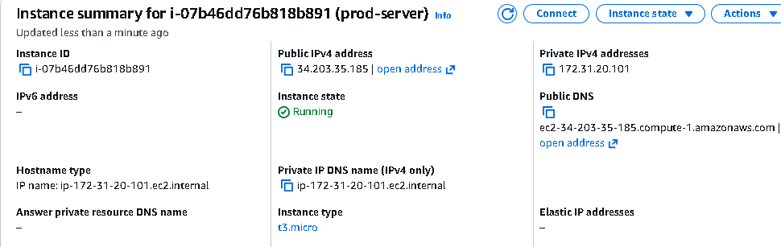
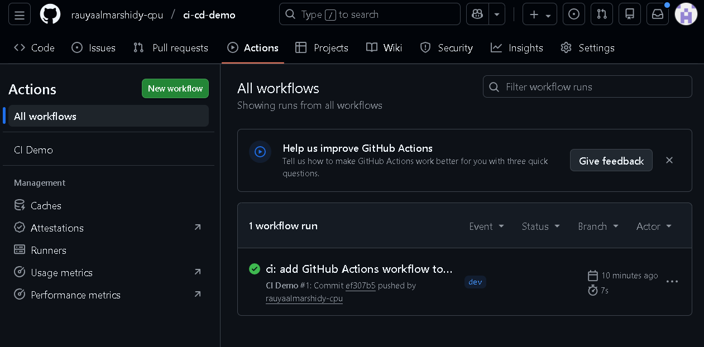
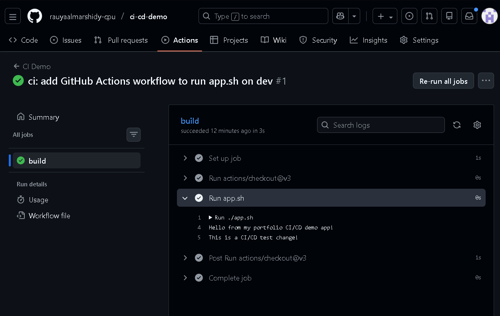
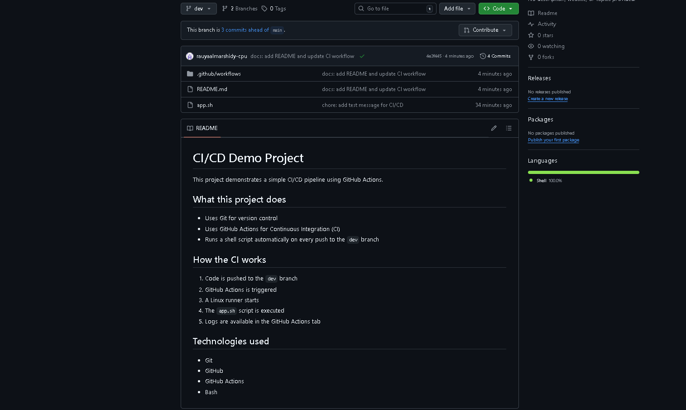

# Cloud & DevOps Portfolio

This portfolio demonstrates hands-on experience with **Terraform**, **AWS**, and **CI/CD using GitHub Actions**.  

It showcases my skills in building cloud infrastructure, automating workflows, and documenting projects professionally.

---

## 🚀 Technologies Used
- Terraform
- AWS (EC2)
- GitHub Actions (CI/CD)
- Linux
- Git & GitHub

---

## 🏗️ Terraform Project

This project demonstrates provisioning cloud resources using Terraform with a clear and modular structure.

### Terraform Structure

### AWS EC2 Instance

---

## 🔄 CI/CD Pipeline (GitHub Actions)

Automation using GitHub Actions to streamline deployment and validation.

### CI Success

### Workflow Logs

### README Preview

---

## ✅ Summary

This portfolio demonstrates:

- Infrastructure as Code using Terraform  
- Provisioning cloud resources on AWS  
- CI/CD automation with GitHub Actions  
- Clear structure and professional documentation

