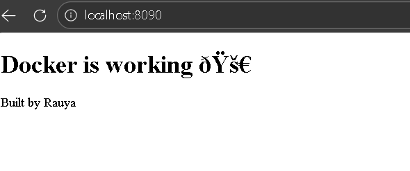

# Docker Demo Project




This project demonstrates containerizing a simple application using Docker, building a Docker image, running it locally, and automating its build and push to Docker Hub using GitHub Actions.

## Project Overview

This project shows how to package an application into a Docker container, run it locally, and automate image deployment. It includes:

- A simple Dockerfile for building the image
- Local testing with Docker
- CI/CD pipeline using GitHub Actions to automatically build and push the Docker image to Docker Hub

## Prerequisites

- Docker installed locally
- Git installed
- GitHub account
- Docker Hub account

## Setup & Run Locally

1. Clone the repository:

```bash
git clone https://github.com/rauya2252/devops-portfolio.git

